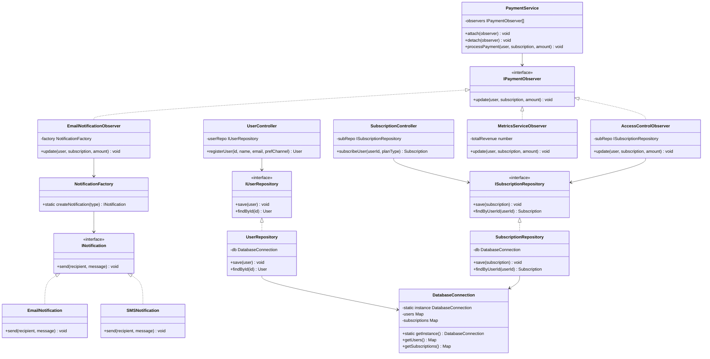

# Sistema de Gestión de Suscripciones y Facturación Premium

- 📋 Información Institucional

Institución: UPC Capilla del Monte

Carrera: Programación Full Stack — 2° Año

Materia: Programación Orientada a Objetos (POO)

Profesor: Narciso Perez

Alumna: Sol De Francesco
---

## 🛠️ Arquitectura y Patrones Utilizados

Este proyecto consiste en el diseño e implementación del backend modular para un sistema de facturación y suscripciones premium utilizando TypeScript y Node.js. La arquitectura fue desarrollada siguiendo rigurosamente los principios SOLID y aplicando los siguientes patrones de diseño:

Singleton (src/Config/DatabaseConnection.ts): Garantiza una única instancia global para simular la persistencia de datos y tablas en memoria.

Factory Method (src/Factories/): Centraliza la creación dinámica de canales de notificación (Email/SMS) basándose en las preferencias configuradas por cada usuario.

Repository (src/Repositories/): Desacopla por completo la lógica de negocio del almacenamiento de datos, implementando la inversión de dependencias mediante interfaces específicas.

Observer (src/Observers/ & src/Services/PaymentService.ts): Gestiona eventos desacoplados tras la confirmación de un pago exitoso, notificando en cadena al control de accesos (activación premium), al sistema de métricas comerciales y al historial de facturación.

MVC (Model-View-Controller): Separación clara de responsabilidades entre Modelos de datos (src/Models), Controladores de flujo (src/Controllers) y la simulación de la interfaz orientada a consola (src/main.ts).

---

## 📁 Estructura del Proyecto Organizada

A continuación se detalla la arquitectura de carpetas del código fuente, estructurada según el patrón arquitectónico MVC y la segregación de responsabilidades:
```text
├── src/
│   ├── Config/
│   │   └── DatabaseConnection.ts     # Singleton de persistencia simulada
│   ├── Models/
│   │   ├── User.ts                   # Entidad de Usuario
│   │   ├── Subscription.ts           # Entidad de Suscripción
│   │   └── Invoice.ts                # Entidad de Factura
│   ├── Controllers/
│   │   ├── UserController.ts         # Coordinador de flujos de Usuario
│   │   └── SubscriptionController.ts # Coordinador de flujos de Suscripciones
│   ├── Repositories/
│   │   ├── IUserRepository.ts        # Interfaz de persistencia de usuarios
│   │   ├── ISubscriptionRepository.ts # Interfaz de persistencia de suscripciones
│   │   ├── UserRepository.ts         # Implementación concreta del repositorio
│   │   └── SubscriptionRepository.ts  # Implementación concreta del repositorio
│   ├── Services/
│   │   ├── PaymentService.ts         # Servicio central de pagos (Sujeto / Subject)
│   │   └── NotificationService.ts    # Despachador de alertas
│   ├── Factories/
│   │   ├── INotification.ts          # Interfaz común de notificaciones (Liskov)
│   │   ├── EmailNotification.ts      # Canal concreto de Email
│   │   ├── SMSNotification.ts        # Canal concreto de SMS
│   │   └── NotificationFactory.ts    # Creador dinámico de canales (Factory Method)
│   ├── Observers/
│   │   ├── IPaymentObserver.ts       # Interfaz común para suscriptores del pago
│   │   ├── EmailNotificationObserver.ts # Genera la factura y envía la alerta
│   │   ├── MetricsServiceObserver.ts # Actualiza métricas de negocio
│   │   └── AccessControlObserver.ts  # Activa accesos premium del usuario
│   └── main.ts                       # Punto de entrada / Simulación de flujos
├── Dockerfile                        # Instrucciones de contenerización
├── .dockerignore                     # Exclusiones para Docker
├── .gitignore                        # Exclusiones para control de versiones
├── package.json                      # Dependencias del proyecto
└── README.md                         # Documentación oficial de entrega
```
---

##📊 Diagrama de Clases UML

El siguiente diagrama detalla el modelado de clases y las relaciones del sistema. Muestra cómo los controladores se comunican con los repositorios y cómo el patrón Observer desacopla el procesamiento de pagos de las tareas secundarias.

(Nota: Este diagrama es renderizado de forma interactiva y nativa por GitHub utilizando Mermaid.js).



---


## 🚀 Ejecución del Proyecto y Prueba de Concepto

- Opción 1: Ejecución Local convencional

Para replicar y probar la ejecución de la arquitectura localmente, siga estos pasos:

Instalar las dependencias de desarrollo necesarias:
```bash
npm install
```

Ejecutar la simulación de las historias de usuario en la consola:
```bash
npx ts-node src/main.ts
```

- Opción 2: Despliegue con Docker (Contenedores)

El proyecto está completamente contenerizado para garantizar que se ejecute de forma aislada en cualquier entorno, sin necesidad de dependencias locales ni configuraciones globales.

Construir la imagen de Docker:
```bash
docker build -t sistema-suscripciones .
```

Ejecutar la aplicación dentro del contenedor:
```bash
docker run sistema-suscripciones
```

---

## 📸 Evidencia de Ejecución Exitosa (Terminal VS Code)

Aquí se muestra la salida real del sistema en consola, demostrando el registro del usuario, la selección del plan y el disparo automático de los eventos del patrón Observer tras procesar el pago de manera exitosa: 

---

## 📦 Gestión del Proyecto y Control de Versiones

- 📅 Tablero Kanban (GitHub Projects)

Para la gestión y planificación de este proyecto se aplicaron metodologías ágiles a través de un tablero Kanban en GitHub Projects. Se definieron historias de usuario y tareas técnicas para la implementación progresiva de los patrones de diseño y los principios SOLID, logrando un control total del ciclo de vida del desarrollo.

[👉 Ver Tablero Kanban Oficial en GitHub Projects](https://github.com/users/SolDF33/projects/4/views/1)
---

## 🎯 Justificación de Criterios Evaluados (Checklist SOLID)

| Principio SOLID | Estrategia Aplicada en el Código |
| :--- | :--- |
| S - Single Responsibility | Cada clase y archivo tiene un rol único y exclusivo. Los modelos manejan solo estructura de datos, los repositorios la persistencia simulada, el servicio procesa la transacción y los controladores coordinan el flujo sin mezclar lógica.|
| O - Open/Closed | El sistema está abierto a la extensión pero cerrado a la modificación. Si mañana se requiere agregar un nuevo canal de notificación (por ejemplo, WhatsApp), basta con crear una nueva clase que implemente INotification y añadirla a la Factory, sin alterar los servicios existentes. |
| L - Liskov Substitution | Las clases concretas EmailNotification y SMSNotification implementan la interfaz común INotification. Pueden intercambiarse transparentemente en la Factory y el sistema seguirá funcionando idénticamente sin romper la consistencia. |
| I - Interface Segregation | Se diseñaron interfaces pequeñas, limpias y altamente específicas (IUserRepository, ISubscriptionRepository, INotification, IPaymentObserver). Se evitó crear una interfaz monolítica "gigante", obligando a las clases a implementar solo los métodos que realmente necesitan. |
| D - Dependency Inversion | Los controladores de alto nivel (UserController, SubscriptionController) no dependen de clases concretas ni de la base de datos directamente. En su lugar, dependen de abstracciones (interfaces), las cuales se inyectan a través de sus constructores (Inyección de Dependencias). |
