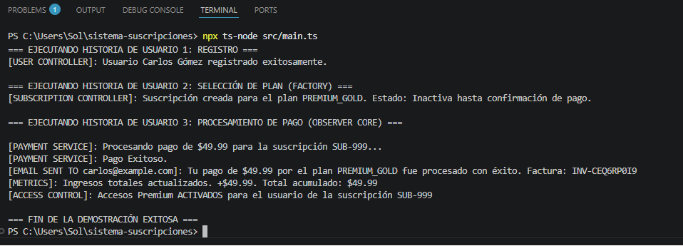

# Trabajo Práctico: Sistema de Gestión de Suscripciones y Facturación Premium

## 📋 Información Institucional
- **Institución:** UPC Capilla del Monte
- **Carrera:** Programación Full Stack — 2° Año
- **Materia:** Programación Orientada a Objetos (POO)
- **Profesor:** Narciso Perez
- **Alumna:** Sol De Francesco

---

## 🛠️ Arquitectura y Patrones Utilizados

Este proyecto consiste en el diseño e implementación del backend modular para un sistema de facturación y suscripciones premium utilizando **TypeScript** y **Node.js**. La arquitectura fue desarrollada siguiendo rigurosamente los principios **SOLID** y aplicando los siguientes patrones de diseño:

- **Singleton (`src/Config/DatabaseConnection.ts`)**: Garantiza una única instancia global para simular la persistencia de datos y tablas en memoria.
- **Factory Method (`src/Factories/`)**: Centraliza la creación dinámica de canales de notificación (Email/SMS) basándose en las preferencias configuradas por cada usuario.
- **Repository (`src/Repositories/`)**: Desacopla por completo la lógica de negocio del almacenamiento de datos, implementando la inversión de dependencias mediante interfaces específicas.
- **Observer (`src/Observers/` & `src/Services/PaymentService.ts`)**: Gestiona eventos desacoplados tras la confirmación de un pago exitoso, notificando en cadena al control de accesos (activación premium), al sistema de métricas comerciales y al historial de facturación.
- **MVC (Model-View-Controller)**: Separación clara de responsabilidades entre Modelos de datos (`src/Models`), Controladores de flujo (`src/Controllers`) y la simulación de la interfaz orientada a consola (`src/main.ts`).

---

## 🚀 Ejecución del Proyecto y Prueba de Concepto

Para replicar y probar la ejecución de la arquitectura, siga estos pasos:

1. Instalar las dependencias de desarrollo necesarias:
```bash
npm install
```

2. Ejecutar la prueba de concepto:
```bash
npx ts-node src/main.ts 
```
---

## 🐳 Opción 2: Despliegue con Docker (Contenedores)

El proyecto está completamente contenerizado para garantizar que se ejecute de forma aislada en cualquier entorno, sin necesidad de dependencias locales ni configuraciones globales.

---

### 1. Construir la imagen de Docker
Ejecuta el siguiente comando en la raíz del proyecto para compilar la imagen:
```bash
docker build -t sistema-suscripciones .
```

### 📸 Evidencia de Ejecución Exitosa (Terminal VS Code)

Aquí se muestra la salida real del sistema en consola, demostrando el registro del usuario, la selección del plan y el disparo automático de los eventos del patrón *Observer* tras procesar el pago:



## 🎯 Justificación de Criterios Evaluados (Checklist SOLID)

| Principio SOLID | Estrategia Aplicada en el Código |
| :--- | :--- |
| **S - Single Responsibility** | Cada clase y archivo tiene un rol único y exclusivo. Los modelos manejan solo estructura de datos, los repositorios la persistencia simulada, el servicio procesa la transacción y los controladores coordinan el flujo sin mezclar lógica. |
| **O - Open/Closed** | El sistema está abierto a la extensión pero cerrado a la modificación. Si mañana se requiere agregar un nuevo canal de notificación (por ejemplo, *WhatsApp*), basta con crear una nueva clase que implemente `INotification` y añadirla a la Factory, sin alterar los servicios existentes. |
| **L - Liskov Substitution** | Las clases concretas `EmailNotification` y `SMSNotification` implementan la interfaz común `INotification`. Pueden intercambiarse transparentemente en la Factory y el sistema seguirá funcionando idénticamente sin romper la consistencia. |
| **I - Interface Segregation** | Se diseñaron interfaces pequeñas, limpias y altamente específicas (`IUserRepository`, `ISubscriptionRepository`, `INotification`, `IPaymentObserver`). Se evitó crear una interfaz monolítica "gigante", obligando a las clases a implementar solo los métodos que realmente necesitan. |
| **D - Dependency Inversion** | Los controladores de alto nivel (`UserController`, `SubscriptionController`) no dependen de clases concretas ni de la base de datos directamente. En su lugar, dependen de abstracciones (interfaces), las cuales se inyectan a través de sus constructores (Inyección de Dependencias). |
